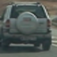
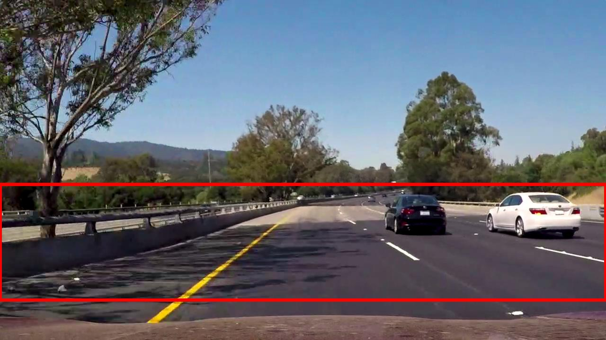
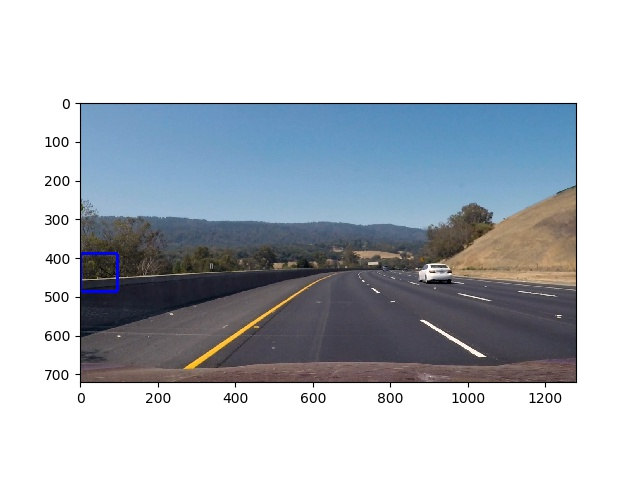
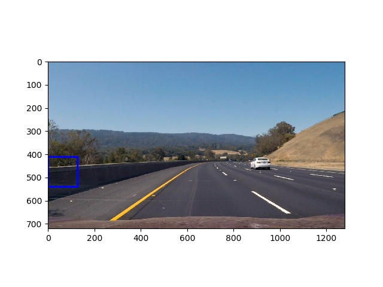
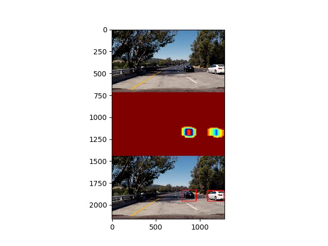

# **Vehicle Detection Project**

The scope of this project is to demonstrate treditional method of detecting vehicles using Histogram of Oriented Gradients (HOG) and Support Vector Machine (SVM). (Most of the modern approch use CNN/Deep learning models for classification/detection of objects)

The following are the over all steps in this project to detect vehicles in an image

* Perform a Histogram of Oriented Gradients (HOG) feature extraction on a labelled training set of images and train a classifier Linear SVM classifier
* Apply a color transform and append binned color features, as well as histograms of color, to your HOG feature vector. 
* Normalize features and randomize a selection for training and testing.
* Implement a sliding-window technique and use your trained classifier to search for vehicles in images.
* Run your pipeline on a video stream and create a heat map of recurring detection frame by frame to reject outliers and follow detected vehicles.
* Estimate a bounding box for vehicles detected.

[//]: # (Image References)
[train.py]: ./src/train.py "Training SVM"
[detection.py]: ./src/detection.py "Vehicle Detection"
[lesson_functions.py]: ./src/lesson_functions.py "Helper functions"
[svc_pickle.p]: ./src/svc_pickle.p "Saved SVM Model"
[vehicle]: https://s3.amazonaws.com/udacity-sdc/Vehicle_Tracking/vehicles.zip "vehicle data"
[non-vehicle]: https://s3.amazonaws.com/udacity-sdc/Vehicle_Tracking/non-vehicles.zip "non-vehicle data"
[output1]: ./output_images/test1.jpg
[output2]: ./output_images/test2.jpg
[output3]: ./output_images/test3.jpg
[output4]: ./output_images/test4.jpg
[output5]: ./output_images/test5.jpg
[output6]: ./output_images/test6.jpg
[output7]: ./output_images/test7.jpg
[output8]: ./output_images/test8.jpg
[output9]: ./output_images/test9.jpg
[output10]: ./output_images/test10.jpg
[outvideo]: ./output_videos/project_video.mp4

---

## Project Files:

The project consists of following files

* [train.py] - Source code to train LinearSVM model over labelled [vehicle] and [non-vehicle] data.
* [detection.py] - Source code to detect vehicles on still images and pre-recorded mp4 video
* [lesson_functions.py] - Helper functions taken from classroom examples
* [svc_pickle.p] - Saved SVM model along with parameters

## Training Model

* Collect labelled data with equal no. of vehicle and non vehicle data

    Sample Vehicle Image 
    
    

    Sample Non-Vehicle Image

    

* Convert BGR to YCbCr color scope

* Get Spatial feature vector of bin size=16 by appending all the 3 channels of the image (converting into single array)

* Calculate histogram of YCbCr for each channel with bin size=16 and append the resulting vectors into single array

* Calculate hog features for all the 3 channels with following parameters: Orients=9, pix_per_cell=8, cell_per_block=2 and get a single hog feature vector appending features from all 3 channels

    

* Append all the above 3 features (spatial, histogram and HOG) in an order (which shall be done similarly during classification)

* Randomize and split the feature vectors thus derived from labeled car and non-car data into training(80%) and testing sets(20%)

* Normalise the data using `StandardScalar` feature. This is required because different types of features yield different range of values. The X_Scalar thus returned from `StandardScaler().fit()` shall be used during classification

* Perform training using SVM algorithm

* Save the model along with the following information in .p (pickle) file which can be used during classification 

    [svm, scalar, orient, pix_per_cell, cell_per_block, spatial_size, hist_bins]

## Vehicle Detection (on image)

* Load the pre-saved model and other information (orientation, scalar, etc.) saved in .p file for classification

* Make sure the image is in the same format when used for training. For eg., in this case `cv2.imread` was used read image files for both training and detection. This would read images in BGR format.

* Use sliding window technique to fetch patch of image which will be fed for classification.

* Various scale of patch windows are chosen and applied on selected Region of Interest (ROI).

* Following are the area under region of interests choosen for getting the window and scale to get 64x64 pixel image to feed classifier

            [(startx,starty), (endx,endy), scale]
            [(0,390),(1280,510), 1.5] -> 100 windows
            [(8,398),(1280,518), 1.5] -> 100 windows
            [(0,412),(1280,660), 2] -> 148 windows

    Sample window from region 1

    

    Sample window from reagion 2

    

    Sample window from reagion 3

    

* Sliding windows are shifted in terms of 2 cells (16 pixels) starting from top left of ROI and moving towards right and down

* Images from the window is passed through same pre-processing pipeline and same scalar normalization as done during training process

* A heat map of shape equal to single channel of image is initialised to zeros and the windows where the prediction of vehicles done are added at the same location in the heat map.

* A threshold is set to avoid false positives.

* Find no. of vehicles detected and the location using `scipy.ndimage.measurements.label`

* Get the boxes from the labels and draw it on original image to show the detected vehicle

    original vs. heatmap vs. labelled

    

### Final output images with vehicle detection

* [output1] 
* [output2] 
* [output3] 
* [output4] 
* [output5] 
* [output6] 
* [output7] 
* [output8] 
* [output9] 
* [output10]

## Vehicle Detection (on video)

* Fetch frames from video file and convert it into BGR format (BGR was used during training)

* Pass the image through same pipeline as done on image above

* To avoid false positives detection in the videos, the detected labels are averaged over time and then converted back to RGB. This is further used to create mp4.

## Final output video with vehicle detection

[outvideo]

---

### Discussion

The following are the problems faced during design/implementation of vehicle detection using HOG and SVM

* Eventhough the classification works well using combination of HOG and SVM (of course including other features), the pipline is very slow when it comes to runtime. This can be overcome by implementing pipeline on ASIC or FPGA but the solution is expensive

* The library versions used while training (pre-process and feature extraction) the same should be used during classification/detection

* Parameters used for feature extraction, scalar should also be maintained along with the model which should be used during classification/detection
